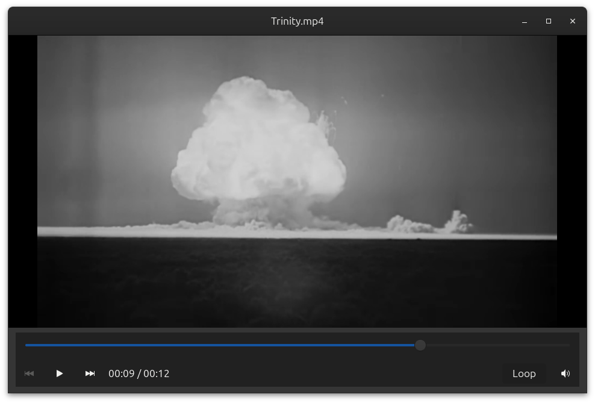

# BrasaPlayer

BrasaPlayer is a small GTK 4 media player intended for GNOME on Wayland. It uses the GTK 4 native media API.

## controls

- `h`: show shortcut help overlay
- `Space`: play/pause
- `Left`: seek backward 5 seconds
- `Right`: seek forward 5 seconds
- `Shift+Left`: seek backward 3 seconds
- `Shift+Right`: seek forward 3 seconds
- `Ctrl+Left`: seek backward 1 minute
- `Ctrl+Right`: seek forward 1 minute
- `v`: subtitles off/on
- `Shift+V`: cycle to the next matching subtitle file
- `s`: save a screenshot of the current frame
- `f` or `F11`: toggle fullscreen
- `double-click`: toggle fullscreen
- `Escape`: quit
